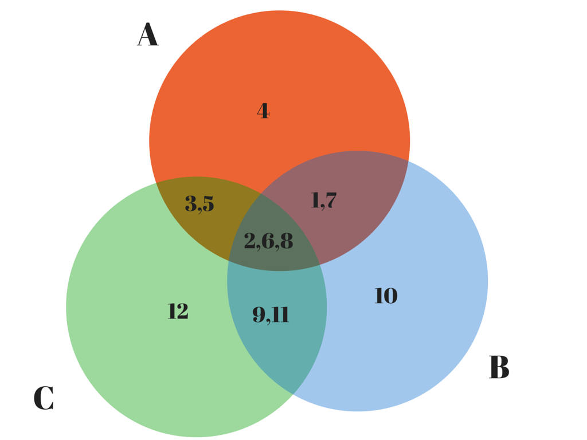
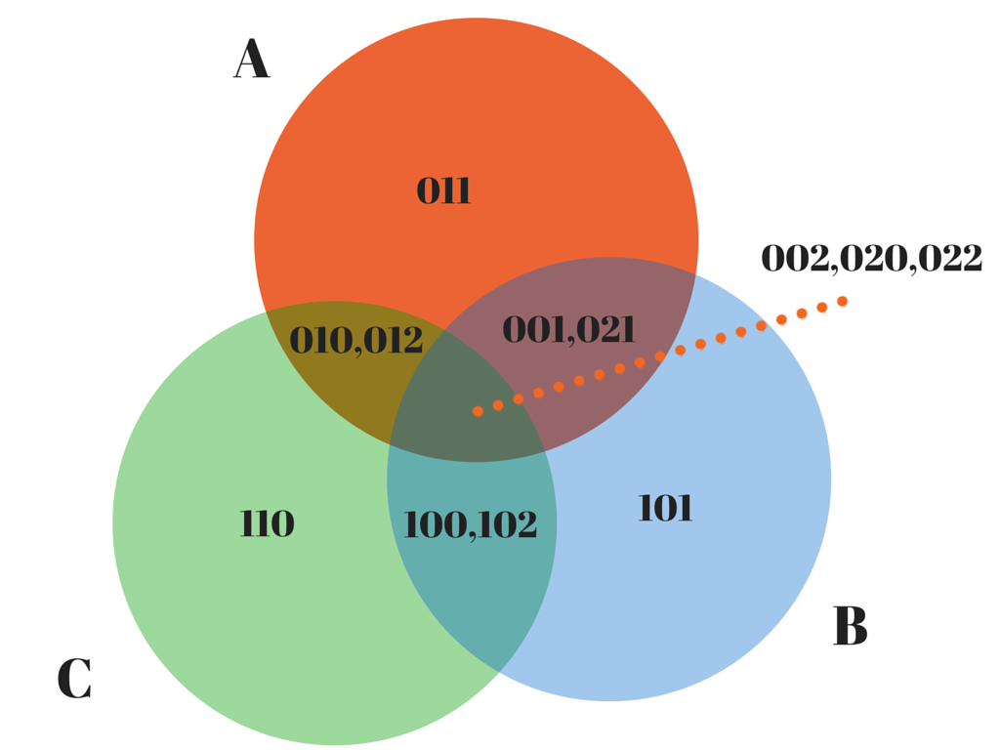

#12 coins

Given:

* 11 coins of identical weight
* 1 coin of a different relative weight
* a set of scales
* a maximum of 3 weighings

Decide which coin has the different weight and whether that weight is less than
or greater than the weight of any of the other 11 coins.

The decide() function is a go-lang solution to this problem. When compiled and
executed, the program tests that function against all 24 possible
configurations.

#A Solution

The solution documented in solution.go is a very pleasing solution.

Unlike the other attempts, this solution only requires 3 weighings and these
weighings are sufficient to discriminate the 24 different possibilities for any
given configuration of the coins.

	func decide(scale Scale) (int, Weight) {

		a := scale.Weigh([]int{0, 3, 5, 7}, []int{1, 2, 4, 6})
		b := scale.Weigh([]int{0, 6, 8, 10}, []int{1, 5, 7, 9})
		c := scale.Weigh([]int{1, 4, 5, 8}, []int{2, 7, 10, 11})

		i := a*9 + b*3 + c
		o := i

		if i > 12 {
			o = 26 - i
		}

		f := int(o - 1)

		w := Weight((func() int {
			switch f >> 2 {
			case 0:
				return f >> 1
			case 1:
				return 1
			default:
				return 0
			}
		}() ^ f&1) << 1)

		if i > 12 {
			w = heavy - w
		}

		return f, w
	}

See the <a href="#simple">link</a> for a slightly simpler variant of this solution.

I have since [discovered](http://www.iwriteiam.nl/Ha12coins.html) that a very
similar solution was discovered in 1961 by Frank Cole. The arithmetic of Cole's
solution is more amenable to being tracked by a human than the bit manipulations
performed here although its [Go representation](https://github.com/jonseymour/12coins/blob/frank-cole/solution.go#L11-L31) is arguably less straight forward.

#Visualising The Structure Of The Solution

The following Venn diagram, which shows the intersections between the sets of
coins involved in all 3 weighings, helps to provide a heuristic justification
for why this set of weighings is capable of discriminating the 24 cases - each
weighing involves overlapping set and subsets of coins and the 12 coins are
evenly distributed across all sets and all intersections between all sets.

Some observations:

- all weighings share 3 coins {1,5,7}
- each weighing shares a different pair of coins with each other weighing
- each pair of two coins shared by two weighings is grouped on one pan by one weighing and split across both pans by the other weighing.
- each weighing has a single coin that is unique to itself
- each weighing shares exactly 5 coins with one weighing and a different (but partially overlapping) set of 5 coins with the other weighing

It would seem that all valid solutions to the 12 coins problem share the same symmetry as this solution although closer examination reveals that beneath this unifying symmetry there are actually 5 structurally
distinct solutions as will be revealed in later sections.

#Explanation Of Completeness

The following argument explains why the configuration of the weighings has
enough information to distinguish the 24 possible configurations. It doesn't
explain why the coin is selected using manipulations of a sum derived from the 3
weighings.

If the B and C weighings are balanced, then the A weighing must be unbalanced
because of the coin unique to A - namely 3.

If the A and B weighings are unbalanced and the C weighing is balanced, then the
cause must be a coin that is common to A and B and not shared by C, namely 0 or
6. If the A and B weighings have the same bias, then the counterfeit coin must
be 0, otherwise it is 6.

If the A, B and C weighings are unbalanced, then the cause must be a coin that
is common to A, B and C - namely 1,5 or 7. If the A and C weighings have the
same bias, then the counterfeit is 5. If B and C have the same bias, then the
counterfeit is 7. If A and B have the same bias, then the counterfeit is 1.

Symmetry arguments allow derivation of other the possible solutions - 2, 4, 8,
9, 10, 11.

#Explanation Of Indexing Behaviour Of Sum

The indexing behaviour of the sum which answers the identity of the coin appears
somewhat magical, and indeed, if I had happened upon a distribution of weights
that had this property it would have been amazing. In reality, in an earlier
iteration I discovered a set of weighings that had the ability to discriminate
the 24 configurations. I then used the sum to calculate an index into two arrays
of length 27 and stored the identity of the coin and the weight of the
counterfeit coin at the indexed element. This array served as a mapping function
from the sum to the identity of the coin.

When I did this, I observed that elements at 0, 13 and 26 were not assigned to
and that coins[13+(n+1)] = coins[13-(n+1)] and weights[13+(n+1)] = 2 -
weights[13-(n+1)] for all n in [0,11]. This realisation allowed the mapping
function to be realised using 2 arrays of 12 elements each and a test for the
magnitude of the sum.

Having done this, I then identified a permutation that allowed me to relabel the
coins such that the content of the i'th element was i, thereby allowing me to
replace the coin mapping function with the identity function and so eliminate
the need for this array in the solution.

Observe that for each set of coins A, B, C one weighing acts as the weight bit
and the other weighings act as an indexing function for the coin. For example,
for the coins 0-7 and the corresponding weights [light,heavy,heavy,light,heavy,light,heavy,light],
the A weighings will all be biased in the light direction (e.g. produce a trit of 0).

The B and C weighings enumerate the 8 trits between 01 and 22. Observe that the B and C weighings
never register 00 (light, light) for any of these coins because any coin that
causes weighing A to produce 0 cannot simultaneously cause both the B and C
weighings to produce 0. Also observe that when the B and C weighings register 11
(equal, equal), then the A weighing directly reveals the weight of the
counterfeit coin that is unique to the A weighing.

#Explanation Of Weight Deriviation Function

One thing that bugged me about the original solution was the somewhat arbitrary nature
of the weight derivation function.

		w := Weight((func() int {
			switch f >> 2 {
			case 0:
				return f >> 1
			case 1:
				return 1
			default:
				return 0
			}
		}() ^ f&1) << 1)

		if i>12 {
			w = heavy - w
		}

This function had been reversed engineered from the mapping of 9a\*3b\*c-1 via a
table that gave the correct weight for each configuration and certainly can't be
justified merely by inspecting the code.

I did notice that the function appeared to have 3 branches controlled by the
higher order bits of sum - in effect, it was a function that was composed of 3
other functions although the significance of this was lost on me at the time.

I also realised that the choice of linear combination I chose was somewhat
arbitrary: I chose 9a + 3b + c, but I could have just as easily selected
9b + 3a + c or any of the other 4 permutations of a,b,c that are possible.

So, I shuffled the sum. This broke the identity function and changed the weight
derivation function so I reintroduced arrays to implement those functions. I
kept shuffling until I stumbled across a weight deriviation function that had a
simpler structure that the original one. I then applied the re-labeling
trick to the resulting solution and ended up with this:

	func decide(scale Scale) (int, Weight) {

		a := scale.Weigh([]int{2, 4, 0, 6}, []int{5, 7, 1, 3})
		b := scale.Weigh([]int{5, 10, 7, 0}, []int{8, 1, 6, 9})
		c := scale.Weigh([]int{2, 11, 7, 1}, []int{5, 8, 10, 4})

		i := a*9 + b*3 + c
		o := i

		if i > 12 {
			o = 26 - i
		}

		f := int(o - 1)

		w := Weight((func() int {
			if f&8 == 0 {
				return f
			} else {
				return 1 ^ f>>1
			}
		})() & 1 << 1)

		if i > 12 {
			w = heavy - w
		}

		return f, w
	}

This is a much simpler function as the weight varies according to the first bit
of the coin identity for the first 8 coins and according to the negation of the
2nd bit for the remaining 4.

Another interesting thing is that while the order of coins in each weighing has
changed, each weighing has the same coins as the original solution. My
conjecture, therefore, is that the indexing property is a function of which
coins are in each weighing and the weight derivation function is a function of
the permutation of the coins in each weighing.  I intend to explore this further
by generating the 4 remaining solutions of this type.

The fact that the coins 0 -> 7 appear in the first weighing of both solutions
is indubitably related to the fact that for these coins to be indexed in the first
8 positions by 9a+3b+3c-1, the first weighing trit (e.g. a) has to be 0 for these 8 coins.
This can only be true for the 4 configurations where one of the coins on the left hand side
is light and the 4 configurations where one of the coins on the right hand side is heavy.

Presumably this style of argument can be extended so show why the other weighings
must contain the coins they do.

#Counting the solutions

The general form of the solution is:

     (a,b,c),((d,e),(f,g),(h,i)),(j,k,l)

where a,b,c occur in at most weighing, (d,e), (f,g), (h,i) appear in exactly two weighings and (j,k,l) appear in all weighings.

There are 12!/9! ways to choose (a,b,c).

There are 9!/6! ways to choose (j,k,l).

There are 6!/2 ways to choose 3 pairs.

There are 2 ways to order each pair.

Multiplying this out, there are unsurprising 12! ways to choose 12 coins.

The next question to decide is for a given assignment of a->l, how many ways are there to organize 3 valid weighings.

There appear to be 5 ways to choose coins from a->l that will produce a weighing that satisifies the constraints.

* nT means choose n elements from (j,k,l).
* 1L means to choose the left side of one pair, e.g. one of (d,f or h)
* 2L means to choose the left sides of two pairs, e.g. (d,f) (f,h) or (h,d)
* 1R means to choose the right side of a pair which was selected by 1L on the left hand side. So one of
(e,g,i) depending on what the choice was for 1L
* 2R means to choose the right side of the two pairs selected by 2L on the left hand side. So, one of
(e,g), (g,i) or (i,e) depending on the choice of 2L on the left hand side.
* 2J means choose both elements of a pair. So (d,e), (f,g) or (h,i).
* 4J means choose both elements of two pairs.
* 1U means choose one element from (a,b,c).

<pre>
p:   (2T, 1L, 1U), (1T, 2J, 1R) -> 3T+1L+1R+2J+1U
q:   (3T, 1L),     (2J, 1R, 1U) -> 3T+1L+1R+2J+1U
r:   (2T, 2L),     (1T, 2R, 1U) -> 3T+2L+2R+1U
s:   (2T, 2J), 	   (1T, 2J, 1U) -> 3T+1U+4J
t:   (3T, 1U),     (2J, 2J)     -> 3T+1U+4J
</pre>

A weighing has structure p if one side has two of the triples, the left side of a pair and one of the singletons on the left side and the other triple, both sides of a pair and the right side of the split pair on the right hand side.

p(0) means:

	2T = j,k
	1L = d
	1U = a
	1T = l
	2J = f,g
	1R = e

whereas p(1) means apply permutation (1,2,0) to the triples, pairs and singletons, before applying p(0) to resulting configuration, so:

	2T = k,l
	1L = f
	1U = b
	1T = j
	2J = h,i
	1R = g

and p(2) means apply the permutation (1,2,0) to the triples, pairs and singletons twice before applying p(0) to the resulting configuration.

	2T = l,j
	1L = h
	1U = c
	1T = k
	2J = d,e
	1R = i

Note that weighings such as:

	(1T, 2J, 1R) (2T, 1L,1U)

that have less triples on the left hand side than the right hand side are obtained simply
by swapping the two sides. This yields 2^3 = 8 permutations.

The valid solutions are triples of weighings with one of these structures:

	(p(0),p(1),p(2))
	(q(0),p(1),p(2))
	(p(0),r(1),s(2))
	(q(0),r(1),s(2))
	(p(0),r(1),t(2))

This is an example of p(0)+p(1)+p(2):

	(j,k,d,a) (l,f,g,e)
	(k,l,f,b) (j,h,i,g)
	(l,j,h,c) (k,d,e,i)

This is an example of q(0)+p(1)+p(2):

	(j,k,l,d) (e,f,g,a)
	(k,l,f,b) (j,h,i,g)
	(l,j,h,c) (k,d,e,i)

This is an example of q(0)+r(1)+s(2):

	(j,k,l,d) (e,f,g,a)
	(k,l,f,h) (j,g,i,b)
	(l,j,d,e) (k,h,i,c)

This is an example of p(0)+r(1)+s(2):

	(j,k,d,a) (l,f,g,e)
	(k,l,f,h) (j,g,i,b)
	(l,j,d,e) (k,h,i,c)

This is an example of p(0),r(1),t(2):

	(j,k,d,a) (l,f,g,e)
	(k,l,f,h) (j,g,i,b)
	(l,j,k,c) (h,i,d,e)

Notice that if you sum the like terms of each solution from both sides,the total is: 6J+9T+3U+3L+3R.

The interpretation of this sum is:

* every member of the triple (j, k, l) appears in 3 weighings => 9T
* every pair is on the same side of one weighing => (6J) and the opposite side on one weighing => (3L+3R)
* every singleton appears once => 3U

An example of an invalid solution is r(0)+s(1)+t(2):

	(j,k,d,f) (l,e,g,a)
	(k,l,f,g) (j,h,i,b)
	(l,j,k,c) (h,i,d,e)

whose terms sum to 9T+3U+2L+2R+8J. Intuitively this is not a solution because
one pair (h,i) is weighed on the same side twice and is never split. This
arrangement prevents discrimination between of the relative weight of h and i.

In fact, for this reason any structure that has more than one weighing with a
structure from the set (s,t) cannot be a solution.

Another class of invalid solution is represented by structures that have more
than 7T's on the left hand side. An example of this class is the solution
q(0)+p(1)+t(2):

	(j,k,l,d) (e,f,g,a)
	(k,l,f,b) (j,h,i,g)
	(l,j,k,c) (h,i,d,e)

In this case, the issue is that there is no way to distinguish the relative
weight of l and k since l and k, when they appear, always appear on the same
side of a weighing and are never split across pans.

Another invalid solution is p(0)+q(1)+r(2). Again, examining the sum of like terms, we see such a
solution has 9T+4J+4L+4R+3U which again does not provide sufficient discrimination between the
pair d and e.

	(j,k,d,a) (l,f,g,e)
	(k,l,j,f) (g,h,i,b)
	(l,j,h,d) (k,i,e,c)

It turns out that of the 125 possible ways to construct a triple from p,q,r,s,t
only 22 of these produce distinct and valid solutions to the 12 coins
problem because of issues of this kind. Of these 22 solutions, 17 are permutatons of the solutions
identified above.

Labeling a solution
--------------------
The objective of labeling is, given a valid solution, identify a tuple of numbers that can be used to
reconstruct that solution at a later time.

1. Count the occurrences of each coin in each weighing. No coin can appear more than once in a given weighing. There should be 3 coins that appear it at most one weighing, 6 coins that appear exactly twice and 3 coins that appear exactly three times. Any other combination of coins will not be a valid solution to the problem. This can be verified by testing the proposed solution against all 24 input configurations.

2. If the left hand side of each weighing contains less triples than the right handside, flip the
weighing and record the fact of the flip. Call this recording (f0,f1,f2) where fn is 1 if the pans of the nth weighing were flipped and 0 if they weren't. Calculate, F = f2*4+f1*2+f0 a number which will be between 0 and 7.

3. Identify the pairs by finding coins that are split across two pans in one weighing and grouped in one pan on the other weighing.

5. Label the structure of each weighing with p,q,r,s,t according to how many of each type of coin
the left hand side of the weighing has.

6. Lookup the structure labeled by step 5. and assign the index of that structure to S
then permute the weighings according to the permutation to produce one of 5 possible structures:
{ppp, qpp, prs, prt or qrs}.

	Note that there may be multiple ways to obtain the required structure from the original permutation. In these cases, we choose one of the possible permutations and always use that one. For example, for weighings of the structure ppp we always choose the permutation (0,1,2). For weighings of the structure qpp, we always choose whichever of (0,1,2), (1,0,2), (2,1,0) produces the correct permutation.

	<table>
	<tr>
		<th>Index</th><th>Structure</th><th>Permutation</th>
	</tr>
	<tr>
		<td>0</td><td>ppp</td><td>0,1,2</td>
	</tr>
	<tr>
		<td>1</td><td>qpp</td><td>0,1,2</td>
	</tr>
	<tr>
		<td>2</td><td>pqp</td><td>1,0,2</td>
	</tr>
	<tr>
		<td>3</td><td>ppq</td><td>2,0,1</td>
	</tr>
	<tr>
		<td>4</td><td>prs</td><td>0,1,2</td>
	</tr>
	<tr>
		<td>5</td><td>psr</td><td>0,2,1</td>
	</tr>
	<tr>
		<td>6</td><td>rps</td><td>1,0,2</td>
	</tr>
	<tr>
		<td>7</td><td>spr</td><td>1,2,0</td>
	</tr>
	<tr>
		<td>8</td><td>rsp</td><td>2,0,1</td>
	</tr>
	<tr>
		<td>9</td><td>srp</td><td>2,1,0</td>
	</tr>
	<tr>
		<td>10</td><td>prt</td><td>0,1,2</td>
	</tr>
	<tr>
		<td>11</td><td>ptr</td><td>0,2,1</td>
	</tr>
	<tr>
		<td>12</td><td>rpt</td><td>1,0,2</td>
	</tr>
	<tr>
		<td>13</td><td>tpr</td><td>1,2,0</td>
	</tr>
	<tr>
		<td>14</td><td>rtp</td><td>2,0,1</td>
	</tr>
	<tr>
		<td>15</td><td>trp</td><td>2,1,0</td>
	</tr>
	<tr>
		<td>16</td><td>qrs</td><td>0,1,2</td>
	</tr>
	<tr>
		<td>17</td><td>qsr</td><td>0,2,1</td>
	</tr>
	<tr>
		<td>18</td><td>rqs</td><td>1,0,2</td>
	</tr>
	<tr>
		<td>19</td><td>sqr</td><td>1,2,0</td>
	</tr>
	<tr>
		<td>20</td><td>rsq</td><td>2,0,1</td>
	</tr>
	<tr>
		<td>21</td><td>srq</td><td>2,1,0</td>
	</tr>
	</table>

	Note that there are 6+6+6+3+1 = 22 possible structures ( or 22 * 8 = 176 if pan flips are included ).

5. Label the singletons (a,b,c) according to which weighing they appear in.

6. Label the triples l,j,k according to the weighing in which they appear as the only triple on one side. In cases where a weighing has all the triples on one side then if that weighing is 0, label the unisolated triple as l, otherwise label it as k. The isolated triple appearing on the right hand side of weighing 1 is always labeled j.

7. Label the pairs according to the order of the weighings in which they are split. If the pair is split in weighing 1 of type r, then assign (f,g) to the pair that was grouped in weighing 0 and (h,i) to the pair that was grouped in weighing 2. The pair split by weighing 0 is always labeled (d,e).

The original weighing is then uniquely identified by:

	((a,b,c)((d,e),(f,g),(h,i)),(j,k,l)),(F),(S)

There are thus:

   	  12! * 22  * 8

 	= 12! * 2^4 * 11
 	= 84304281600
 	= ~2^37

solutions to the 12 coins problem, excluding the 4!^6 trivial variants of each solution generated simply
by permuting the coins in each pan.

#Numbering each solution.

The objective of numbering a solution is to identify a function that maps each tuple to a single number such that the inverse function maps the number back to a single tuple which can then be used to construct
the solution.

The solutions can be numbered with a formula of this kind:

	= P12(a,b,c,d,e,f,h,i,j,k,l)*176 + F*22 + S

where:

* P12 is a function that uniquely numbers the permutation of 1,2,3,4,5,6,7,8,9,10,11,12 that produces
a,b,c,d,e,f,g,h,i,j,k,l
* F is a number between 0-7 representing the pans that need to be flipped in order to make each weighing match of the 5 weighing structures: p,q,r,s or t.
* S is a number between 0 and 21 representing the 22 possible permutations of the 5 canonical solution structures to the found solution structure.

#Deriving a solution from a number.

To derive the n'th solution of the 12 coins problem rewrite n in the form:

	n = p*176+r

Map p to the permutation of {1,2,3,4,5,6,7,8,9,10,11,12} that p identifies.

Rewrite r in the form:

	r = 22*f+s

map s to one of 22 different structures.

Rewrite f in the form:

	f = 4*f2 + 2*f1 + f0

Allocate the coins according to the allocations implied by the identified structure then permute the weighings according to the identified permutation. Flip the pans according to the bits f2, f1 and f0.

#Tools

To help validate that the numbering solution was reasonable, I wrote a tool that can convert
a number between 0 and 84304281600 - 1 into a unique solution to the 12 coins problem or alternatively
encode a valid solution to the 12 coins problem into a unique number between 0 and 84304281600 - 1.

To use the tools, set up a go-lang environment, then run:

	go get github.com/jonseymour/12coins/tools
	cd $GOPATH/src/github.com/jonseymour/12coins/tools
	go build
	echo "0 1 4 10 16" | tr ' ' \\012 | ./tools --decode

This will generate the first 5 structurally distinct solutions to the 12 coins problem, as numbered by
my numbering scheme:

	{
		"weighings":[
			[[1,4,10,11],[12,5,6,7]],
			[[2,6,11,12],[10,7,8,9]],
			[[3,8,12,10],[11,9,4,5]]],
		"unique":[1,2,3],
		"pairs":[[4,5],[6,7],[8,9]],
		"triples":[10,11,12],
		"structure":["p","p","p"],
		"S":0,
		"F":0,
		"P":[0,1,2,3,4,5,6,7,8,9,10,11],
		"N":0
	}

	{
		"weighings": [
			[[10,11,12,4],[5,6,7,1]],
			[[2,6,11,12],[10,7,8,9]],
			[[3,8,12,10],[11,9,4,5]]],
		"unique": [1,2,3],
		"pairs": [[4,5],[6,7],[8,9]],
		"triples":[10,11,12],
		"structure":["q","p","p"],
		"S":1,
		"F":0,
		"P":[0,1,2,3,4,5,6,7,8,9,10,11],
		"N":1
	}

	{
		"weighings":[
			[[1,4,10,11],[12,5,6,7]],
			[[11,12,6,8],[10,7,9,2]],
			[[12,10,4,5],[11,8,9,3]]],
		"unique": [1,2,3],
		"pairs": [[4,5],[6,7],[8,9]],
		"triples": [10,11,12],
		"structure": ["p","r","s"],
		"S":4,
		"F":0,
		"P":[0,1,2,3,4,5,6,7,8,9,10,11],
		"N":4
	}

	{
		"weighings":[
			[[1,4,10,11],[12,5,6,7]],
			[[11,12,6,8],[10,7,9,2]],
			[[12,10,11,3],[8,9,4,5]]],
		"unique":[1,2,3],
		"pairs":[[4,5],[6,7],[8,9]],
		"triples":[10,11,12],
		"structure":["p","r","t"],
		"S":10,
		"F":0,
		"P":[0,1,2,3,4,5,6,7,8,9,10,11],
		"N":10
	}

	{
		"weighings":[
			[[10,11,12,4],[5,6,7,1]],
			[[11,12,6,8],[10,7,9,2]],
			[[12,10,4,5],[11,8,9,3]]],
		"unique":[1,2,3],
		"pairs":[[4,5],[6,7],[8,9]],
		"triples":[10,11,12],
		"structure":["q","r","s"],
		"S":16,
		"F":0,
		"P":[0,1,2,3,4,5,6,7,8,9,10,11],
		"N":16
	}

If you have a lot of time and CPU to spare, you can generate all 84304281600 solutions to the problem with:

	n=0; while test $n -lt 84304281600; do
		echo $n
		let n=n+1
	done | ./tools --decode

If you want a random solution, you can do:

	expr $RANDOM \* $RANDOM | ./tools --decode

Alternatively, it is possible to pipe a JSON encoding of a 12 coins solution into the program and it will encode the solution as a number between 0 and 84304281600 - 1. For example, to encode one of the solutions from Frans' [page](http://www.iwriteiam.nl/Ha12coins.html) about the 12 coins problem, run:

	echo '{"weighings":[[[1,2,3,10],[4,5,6,11]],[[1,2,3,11],[7,8,9,10]],[[1,4,7,10],[2,5,8,12]]]}' | ./tools --encode

which yields:

	41981248865

Other options allow you to relabel any working solution into an indexing solution of the kind described
above, so:

	echo 41981248865 | ./tools --decode --relabel

will permute one of Frans' solutions into an indexing solution.

The --reverse option allows you to reverse engineer a lookup table and weights array that allows you
to convert the sum abs(9a + 3b + c - 13) into a coin index.

	echo 83235379605 | ./tools --decode --reverse

which produces:

	{
		"weighings": [
			[[1,7,3,5],[6,2,8,4]],
			[[8,6,11,1],[2,9,7,10]],
			[[12,3,2,8],[6,5,11,9]]
		],
		"coins": [1,2,3,4,5,6,7,8,9,10,11,12],
		"weights": [0,2,0,2,0,2,0,2,2,2,0,0]
	}

which is a 1-based variant of one of the indexing solutions described above.

Notice how the coins array is numbered in strictly increasing order from 1 and the weights array alternates
according to the lower bit of the coin id for the first 8 coins and with the negation of the 2nd lowest bit
for the remaining 4 coins.

Some solutions aren't readily indexed because LLL, HHH and EEE are all valid solutions. To convert such a solution (such as 83235379649) into a readily indexed soltion (in this case 83235379605)
add a --flip option to produce a solution such that LLL, HHH and EEE are all invalid weighings. So:

	echo 83235379649 | ./tools  --decode --reverse --flip

You can also use the tool to test whether a candidate solution is a valid solution.

	echo '{"weighings":[[[7,2,3,10],[4,5,6,11]],[[1,2,3,11],[7,8,9,10]],[[1,4,7,10],[2,5,8,12]]]}' | ./tools --encode

produces, on stderr:

	error: structure: not a valid solution because of 4 failures: {"weighings":[[[2,3,7,10],[4,5,6,11]],[[1,2,3,11],[7,8,9,10]],[[1,4,7,10],[2,5,8,12]]],"failures":[{"coin":7,"weight":0},{"coin":10,"weight":0},{"coin":8,"weight":0},{"coin":1,"weight":2}]}

You can filter in only candidates which are valid solutions with:

	echo '{"weighings":[[[7,2,3,10],[4,5,6,11]],[[1,2,3,11],[7,8,9,10]],[[1,4,7,10],[2,5,8,12]]]}' | ./tools --valid

#Other notes

Adding one to each coin identifier in the diagram above (so they are numbered 1->12 instead of 0-11),
yields this Venn diagram where the even coins are shared by an odd number of weighings and
the odd coins by an even number of weighings.

Converting these numbers to base 3 yeilds a diagram which shows that the coins
in the intersection between two sets share the same base 3 digit and this digit
is also shared by the coins unique to each set.

