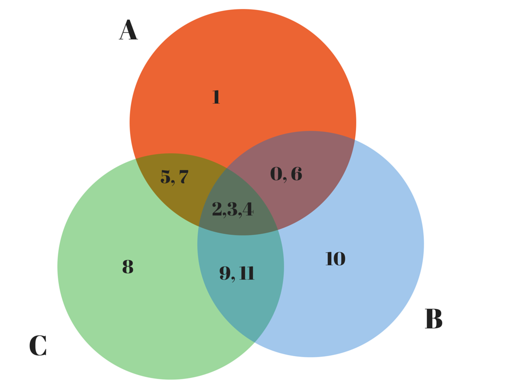

#12 coins

Given:

* 11 coins of identical weight
* 1 coin of a different relative weight
* a set of scales
* a maximum of 3 weighings

Decide which coin has the different weight and whether that weight is less than or greater than the weight
of any of the other 11 coins.

The decide() function is a go-lang solution to this problem. When compiled and executed, the program tests
that function against all 24 possible configurations.

#The Solution

The solution documented in solution.go is a very pleasing solution.

Unlike the other attempts, this solution only requires 3 weighings and these weighings are sufficient to discriminate the 24 different possibilities for any given input configuration.

    var (
        weights = []Weight{
            light, heavy, heavy,
            light, heavy, light,
            heavy, light, light,
            heavy, light, heavy,
        }
    )

    func decide(scale Scale) (int, Weight) {

        a := scale.Weigh([]int{0, 3, 5, 7}, []int{1, 2, 4, 6})
        b := scale.Weigh([]int{0, 6, 8, 10}, []int{1, 5, 7, 9})
        c := scale.Weigh([]int{1, 4, 5, 8}, []int{2, 7, 10, 11})

        i := a*9 + b*3 + c
        o := i

        if i > 12 {
            o = 26 - i
        }

        f := int(o - 1)
        w := weights[o-1]

        if i > 12 {
            w = heavy - w
        }

        return f, w
    }

The following Venn diagram, which shows the intersections between the sets of cois involved in all 3 weighings, helps to provide a heuristic justification for why this set of weighings is capable of discriminating the 24 cases - each weighing involves overlapping
set and subsets of coins and the 12 coins are evenly distributed across all sets and all intersections between all sets.

Some observations:

- 3 weighings share 3 coins {1,5,7}
- each weighing shares a different 2 coins with each other weighing
- each weighing has 3 coins that are unique to itself

#Explanation

If the B and C weighings are balanced, then the A weighing must be unbalanced because of the coin unique to A - namely 3.

If the A and B weighings are unbalanced and the C weighing is balanced, then the cause must be a coin that is common to A and B and not shared by C, namely 0 or 6. If the A and B weighings have the same bias, then the counterfeit coin must be 0, otherwise it is 6.

If the A, B and C weighings are unbalanced, then the cause must be a coin that is common to A, B and C - namely 1,5 or 7. If the A and C weighings have the same bias, then the counterfeit is 5. If B and C have the same bias, then the counterfeit is 7. If A and B have the same bias, then the counterfeit is 1.

Symmetry arguments allow derivation of other the possible solutions - 2, 4, 8, 9, 10, 11.