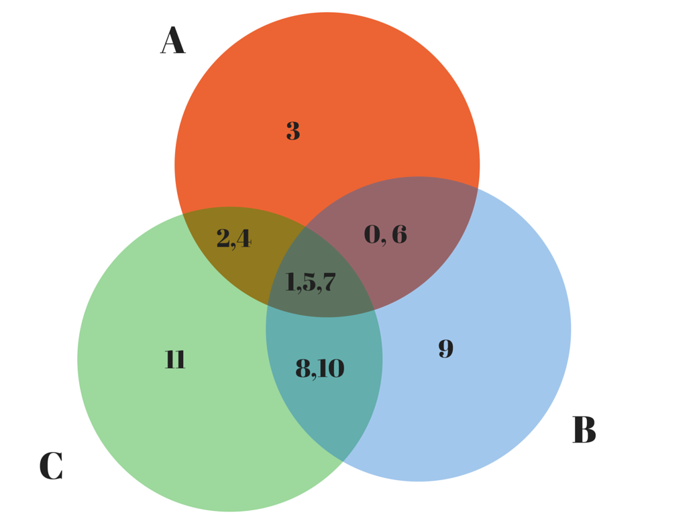

#12 coins

Given:

* 11 coins of identical weight
* 1 coin of a different relative weight
* a set of scales
* a maximum of 3 weighings

Decide which coin has the different weight and whether that weight is less than or greater than the weight
of any of the other 11 coins.

The decide() function is a go-lang solution to this problem. When compiled and executed, the program tests
that function against all 24 possible configurations.

#The Solution

The solution documented in solution.go is a very pleasing solution.

Unlike the other attempts, this solution only requires 3 weighings and these weighings are sufficient to discriminate the 24 different possibilities for a given input configuration.

    package main

    // Decide returns the identity of the counterfeit coin and what the relative
    // weight of that coin is with respect to any other coin.

    var (
        coins   = []int{0, 4, 5, 1, 7, 2, 6, 3, 11, 10, 9, 8}
        weights = []Weight{
            light, heavy, heavy, light,
            heavy, light, heavy, light,
            light, heavy, light, heavy,
        }
    )

    // The simplest possible solution. 3 comparisons + 2 table lookup, deals with every case.
    func decide(scale Scale) (int, Weight) {
        a := scale.Weigh([]int{0, 1, 2, 3}, []int{4, 5, 6, 7})   // 8,9,10,11
        b := scale.Weigh([]int{0, 6, 9, 11}, []int{2, 3, 4, 10}) // 1,5,7,8
        c := scale.Weigh([]int{2, 4, 7, 11}, []int{3, 5, 8, 9})  // 0,1,6,10

        i := a*9 + b*3 + c
        o := i

        if i > 12 {
            o = 26 - i
        }
        f := coins[o-1]
        w := weights[o-1]

        if i > 12 {
            w = heavy - w
        }

        return f, w
    }

Some notes about the solution:

- 3 weighings share 3 coins {2,3,4}
- each weighing shares a different 2 coins with each other weighing
- each weighing puts one pair on the same side of the scale, and splits the other pair across both sides of the scale
- each weighing has 3 coins that are unique to itself